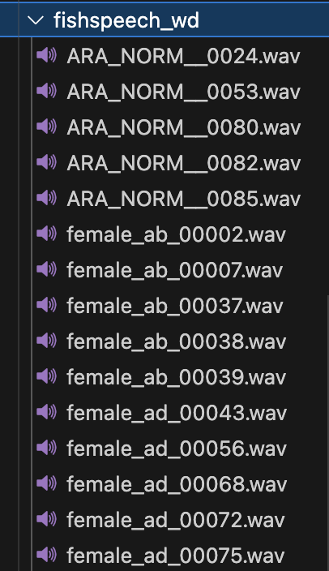
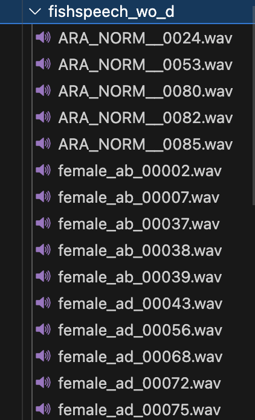
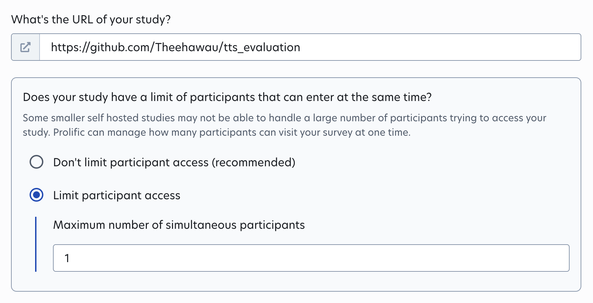

# 1. TTS Preference Test Interface 

## Overview
This repository provides code for preference test for speech synthesis experiments.


## Installation
### Prerequisites
Ensure you have the following dependencies installed:
- Python 3.x
- Required libraries: `gradio`, `argparse`, `glob`

### Usage

Run below code (prefarably in a tmux session) gives a shareable link to the evaluation interface.

```bash
python preference_test_code.py \
    --out_folder /home/hawau/Documents/projects/tts_evaluation/evaluation_results_experimentX \
    --sample_A /home/hawau/Documents/projects/evaluation/artst_arvoice_evaluation/wo_d \
    --sample_B /home/hawau/Documents/projects/evaluation/arvoice_h_r_wd_prolific
```

out_folder: individual preference scores per user will be saved in this folder

sample_A: this folder contains **.wav files** generated from experiment/model A

sample_B: this folder contains **.wav files** generated from experiment/model B

#### Creating Test Set
Choose randomly 15 < X > 20 samples from the test set. For each model/expermient synthesise audios for the transcriptions and save the audios with corresponding original file name. Save the output from each model/experiment in a well-defined folde name e.g for experiment with diacritics save generated samples to `\home\user.name\generated_with_diacritcics` 

!!! 
- The number of samples in sample_A and sample_B must be equal and file basenames should be similar.

- Ensure to include a control sample to validate the user's response. Something like a ground truth audio (sample a) vs generated audio (sample b), in this case you expect the response to be A is better.
- The code randomly shuffles the samples so displayed A contains samples from both experiments and vice versa. (Don't think too much about this, just so samples from experiment A are displayed as sample B sometimes to users)
- Second-level timestamps for each sample rating is saved as well (this can be used to roughly validate user's response as well)

### Usage With Prolific

Duplicate study `experiment_X` in drafts and edit details for your experiment.

Number of evaluators is set to 10 in `experiment_X`. Can be modified as needed (keep in mind the budget for your experiment)

Language filter is set in `experiment_X` as well to ensure the evaluators speak Arabic.

Use the link generated from above as link to survey.

!!! The number of concurrent users **must be set to 1** to avoid response overwrite issues.



**‼️ Make sure to triple check your survey interface before publishing your survey as a published survey cannot be modified and is pre-paid. It should be in a tmux session to avoid gradio link shutdown incase of terminal closure. You do not need a GPU for this. ‼️**


### Common Errors & Warnings

The error below occurs because gradio doesn't have access to paths, In line 153 of `preference_test_code.py` add  root path of audio samples to list of `allowed_paths`.

```bash
...
raise InvalidPathError(msg)
gradio.exceptions.InvalidPathError: Cannot move ...
```

This warning can be ignored.
```bash
/home/hawau/miniconda3/envs/speech/lib/python3.10/site-packages/gradio/utils.py:999: UserWarning: Expected 1 arguments for function <function <lambda> at 0x7feb8592f6d0>, received 0.
  warnings.warn(
/home/hawau/miniconda3/envs/speech/lib/python3.10/site-packages/gradio/utils.py:1003: UserWarning: Expected at least 1 arguments for function <function <lambda> at 0x7feb8592f6d0>, received 0.
```
